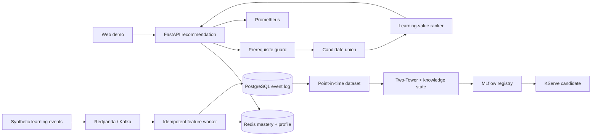

# EduRecOps — Outcome-aware Course Recommendation Platform

> Một nền tảng gợi ý khóa học thời gian thực, ưu tiên **mức độ sẵn sàng** và **giá trị học tập** thay vì chỉ tối đa hóa lượt nhấp.

EduRecOps là đồ án độc lập trong miền giáo dục. Hệ thống thu thập hành vi học tập, duy trì learner mastery online, lọc điều kiện tiên quyết, hợp nhất nhiều nguồn candidate và trả Top-K qua FastAPI. Vòng đời model được thiết kế cho point-in-time training, MLflow lineage, quality gates và progressive rollout.

## Vì sao đề tài này khác biệt?

- **Prerequisite guard là hard constraint:** điểm relevance không thể vượt qua kiến thức nền còn thiếu.
- **Learning-value policy:** kết hợp affinity, readiness, learning gap, quality, novelty, popularity và exploration.
- **Outcome-aware evaluation:** completion và assessment gain đứng cùng hàng với Recall/NDCG.
- **Replayable by design:** response mang request, policy, model và feature timestamps.
- **Responsible experimentation:** impression + propensity logging phục vụ IPS/SNIPS/DR khi đủ điều kiện.

## Kiến trúc



## Chạy local

Yêu cầu: Docker và Docker Compose.

```bash
cp .env.example .env
make up
make smoke
```

| Dịch vụ | URL |
| --- | --- |
| Web demo | http://localhost:8080 |
| API docs | http://localhost:8000/docs |
| Redpanda Console | http://localhost:8081 |
| MLflow | http://localhost:5000 |
| Prometheus | http://localhost:9090 |

Tạo 500 event mẫu:

```bash
make generate
```

Kiểm tra repo:

```bash
make validate
```

## API contract

```bash
curl -X POST http://localhost:8000/v1/recommendations \
  -H 'Content-Type: application/json' \
  -d '{"user_id":"u-1001","top_k":5,"context":{"device":"web","hour":20}}'
```

Response chứa:

- `request_id`, `policy_id`, `model_version`;
- `feature_source`, `feature_generated_at`, `served_at`;
- candidate source, score breakdown và lý do giải thích cho từng khóa học.

## Cấu trúc repo

```text
apps/                  API, event generator, streaming feature worker
packages/edurec_core/  Domain, eligibility, policy và evaluation primitives
feature_repo/          Feast feature definitions
ml/                    Two-Tower và training scaffold
monitoring/            Drift job
pipelines/kubeflow/    Validate → train → evaluate → register
infra/                  PostgreSQL, Prometheus, Kubernetes/KServe
scripts/                Repository validation
web/                    Responsive recommendation demo
docs/                   Architecture, contracts, evaluation, research, runbook
tests/                  Policy, event-contract và metric tests
```

## Research gates

| Nhóm | Mục tiêu ban đầu |
| --- | --- |
| Retrieval | Recall@50 ≥ 0.35 và không giảm theo cohort |
| Ranking | NDCG@10 ≥ 0.20; báo cáo calibration |
| Learning | Không giảm completion@30d; theo dõi assessment gain |
| Serving | p95 < 150 ms tại 100 RPS trong demo |
| Freshness | Feature age < 10 giây |
| Reliability | Replay duplicate/out-of-order không làm sai state |

Xem [research plan](docs/research-plan.md), [evaluation protocol](docs/evaluation.md), [architecture](docs/architecture.md), [data contracts](docs/data-contracts.md) và [runbook](docs/runbook.md).

## Nguồn cảm hứng và tính độc lập

Dự án học hỏi các pattern kiến trúc production từ [RecSys-MLops](https://github.com/itsmekhoathekid/RecSys-MLops/) như streaming features, feature store, registry, canary và observability. EduRecOps không sao chép miền e-commerce hay mã nguồn của repo đó: bài toán, data contract, prerequisite policy, learning-outcome evaluation, mã nguồn và tài liệu được xây dựng riêng. Xem [NOTICE.md](NOTICE.md).

## License

MIT — xem [LICENSE](LICENSE).
