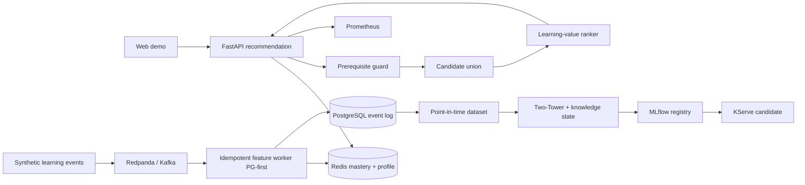

# EduRecOps — Outcome-aware Course Recommendation Platform

> A real-time course recommendation platform that prioritizes **learner readiness** and **learning value** instead of maximizing clicks alone.

EduRecOps is an independent education-domain project. The system captures learning behavior, maintains an online learner-mastery profile, enforces prerequisite constraints, combines multiple candidate sources, and serves Top-K recommendations through FastAPI. The model lifecycle is designed around point-in-time training, MLflow lineage, quality gates, and progressive rollout.

## What makes this project different?

- **Prerequisite guard as a hard constraint:** relevance cannot override missing foundational knowledge.
- **Learning-value policy:** combines affinity, readiness, learning gaps, quality, novelty, popularity, and exploration.
- **Outcome-aware evaluation:** completion and assessment gains are evaluated alongside Recall and NDCG.
- **Replayable by design:** every response carries request, policy, model, and feature timestamps.
- **Responsible experimentation:** impression and propensity logging supports IPS, SNIPS, and DR when the assumptions are valid.

## Architecture



## Run locally

Requirements: Docker and Docker Compose.

```bash
cp .env.example .env
make up
make smoke
```

| Service | URL |
| --- | --- |
| Web demo | http://localhost:8080 |
| API docs | http://localhost:8000/docs |
| Redpanda Console | http://localhost:8081 |
| MLflow | http://localhost:5000 |
| Prometheus | http://localhost:9090 |

Generate 500 sample events:

```bash
make generate
```

Validate the repository:

```bash
make validate
```

## API contract

```bash
curl -X POST http://localhost:8000/v1/recommendations \\
  -H 'Content-Type: application/json' \\
  -d '{\"user_id\":\"u-1001\",\"top_k\":5,\"context\":{\"device\":\"web\",\"hour\":20}}'
```

The response includes:

- `request_id`, `policy_id`, and `model_version`;
- `feature_source`, `feature_generated_at`, and `served_at`;
- candidate source, score breakdown, and explanations for every recommended course.

## Repository layout

```text
apps/                  API, event generator, and streaming feature worker
packages/edurec_core/  Domain, eligibility, policy, and evaluation primitives
feature_repo/          Feast feature definitions
ml/                    Two-Tower model and training scaffold
monitoring/            Drift job
pipelines/kubeflow/    Validate → train → evaluate → register
infra/                  PostgreSQL, Prometheus, and Kubernetes/KServe
scripts/                Repository validation
web/                    Responsive recommendation demo
docs/                   Architecture, contracts, evaluation, research, and runbook
tests/                  Policy, event-contract, and metric tests
```

## Research gates

| Area | Initial target |
| --- | --- |
| Retrieval | Recall@50 ≥ 0.35 with no cohort regression |
| Ranking | NDCG@10 ≥ 0.20 with calibration reporting |
| Learning | No regression in completion@30d; track assessment gains |
| Serving | p95 < 150 ms at 100 RPS in the demo environment |
| Freshness | Feature age < 10 seconds |
| Reliability | Duplicate and out-of-order replay does not corrupt state |

See the [research plan](docs/research-plan.md), [evaluation protocol](docs/evaluation.md), [architecture](docs/architecture.md), [data contracts](docs/data-contracts.md), and [runbook](docs/runbook.md).

## License

MIT — see [LICENSE](LICENSE).
