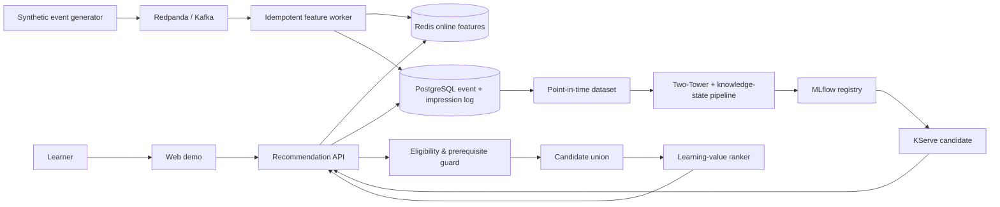

# EduRecOps architecture

EduRecOps separates **academic constraints** from **probabilistic ranking**. A high click score can never allow a course to bypass missing prerequisites.

## Online path

1. Events are partitioned by `user_id`; `event_id` is the durable idempotency key in PostgreSQL.
2. The worker inserts each event with `ON CONFLICT DO NOTHING`. Redis feature updates run **only** when a new row is inserted. A Redis dedup marker is a fast-path cache, not the source of truth.
3. The API loads mastery, interests, recent categories, completed courses, and `features_updated_at`.
4. The eligibility guard removes completed courses, language mismatches, and courses with unmet prerequisites.
5. The policy ranks candidates using affinity, readiness, learning value, quality, novelty, popularity, and a small exploration quota.
6. Every response includes `request_id`, `policy_id`, `model_version`, feature timestamps, and one impression row per displayed course.

## Offline path

1. Impressions, exposure, and outcomes are joined through `request_id` and `impression_id`.
2. The dataset builder performs a temporal split and point-in-time joins.
3. The pipeline trains retrieval, knowledge-state, and ranking models; MLflow records lineage.
4. A candidate must pass accuracy, learning-proxy, fairness, and operational quality gates.
5. Traffic ramps through shadow → 10% → 25% → 50%, with rollback when any gate fails.

## Core differences

- The objective is **learning value**, not CTR alone.
- Prerequisites are hard constraints.
- Mastery is a versioned, timestamped state.
- Impression logging is mandatory rather than an afterthought.
