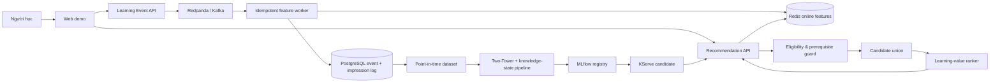

# Kiến trúc EduRecOps

EduRecOps tách **ràng buộc học thuật** khỏi **xếp hạng xác suất**. Điểm click không thể giúp một khóa học vượt qua điều kiện tiên quyết.

## Online path

1. Event được partition theo `user_id`; `event_id` là idempotency key.
2. Worker ghi event vào PostgreSQL và cập nhật Redis trong thao tác có dedup marker.
3. API tải mastery, interests, recent categories và completed courses.
4. Eligibility guard loại khóa đã hoàn thành, sai ngôn ngữ hoặc thiếu prerequisite.
5. Policy xếp hạng theo affinity, readiness, learning value, quality, novelty, popularity và một exploration quota nhỏ.
6. Response luôn mang `request_id`, `policy_id`, `model_version` và feature timestamps để replay.

## Offline path

1. Impression, exposure và outcome được nối bằng `request_id`/`impression_id`.
2. Dataset builder thực hiện time split và point-in-time join.
3. Pipeline huấn luyện retrieval, knowledge-state baseline và ranker; MLflow lưu lineage.
4. Candidate phải vượt quality gate theo accuracy, learning proxy, fairness và vận hành.
5. Shadow → 10% → 25% → 50%; rollback nếu bất kỳ gate nào thất bại.

## Khác biệt cốt lõi

- Mục tiêu là **learning value**, không chỉ CTR.
- Prerequisite là hard constraint.
- Mastery là trạng thái có version và timestamp.
- Impression logging là thành phần bắt buộc, không phải việc bổ sung sau.
